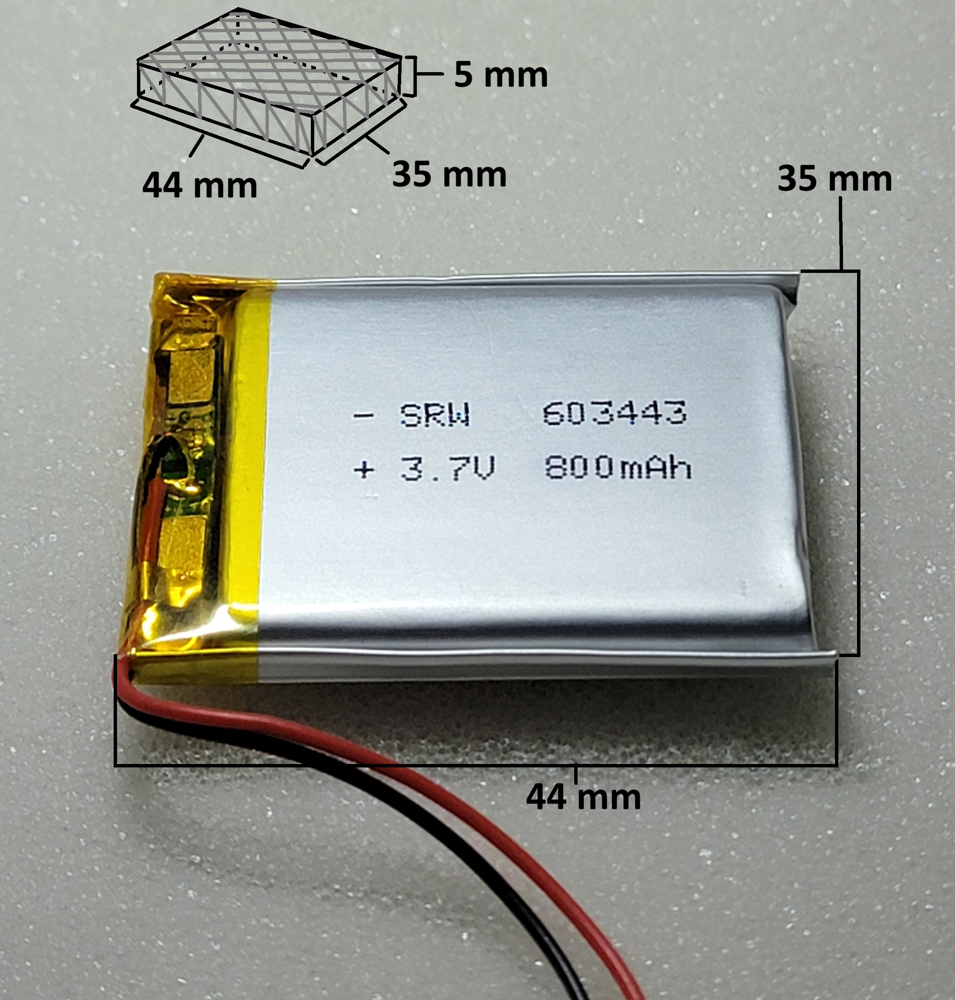

# Wireless Box 
Engineering gives us tools to think and implement solutions to solve specific problems. Problem solving is about making our everyday life simpler and easier. 

# What is Wireless Box? 
Today's smartphones are "mostly" AUX-free. Which means it does not support the common and lovely 3.5mm AUX port anymore. On the other hand, speakers and headphones still use 3.5mm AUX ports as industry standard.
So how do we connect our high-quality speaker that uses AUX cable to the smartphone? YUB Bluetooth!! Wireless Box is just a box that contain an AUX port as an input connected to a Bluetooth adapter to emit and receive sound. 

# WHY?? 
Well, we can just buy a Bluetooth speaker, right?? Well... you can BUT, you would buy a Bluetooth headphone and another Bluetooth speaker and another Bluetooth media player for the car etc... Having a Box that provides the "Wireless" functionality is useful and encapsulated. So, you can have your "Box" everywhere for whatever AUX-port and it will work just as a normal Bluetooth device. 

# Bro you are a programmer?!
Ummmm, I am not specifically a programmer rather than an engineer. I am a problem solver and an engineer. So programming is just a "tool" that I would use beside the analysis and problem-solving skills to obtain a real-life solution. This project might NOT have a lot of coding, but has a lot to do with problems solving and real-life experience.

# Direct Dive into the details
  * **Main Components**
      1. rechargeable battery
      2. Bluetooth circuit
      3. Charging and safety circuit
      4. Toggle Button

  * **The battery specs**
    * 44 mm * 35 mm * 5 mm 
    * Li-Po chemistry rechargeable battery
    * 3.7 Voltage
    * 800 mA capacity
    * 
      
  * **The Bluetooth circuit specs** 
    * 33 mm * 30 mm * 7 mm 
    * XY-BT-MINI Bluetooth circuit
    * AUX Port for output sound 
    * Micro USB port for power input
    * JL AC23B Bluetooth audio decoder
    * slots for power input ( BAT + - )
    * slots for sound output ( L G R )
    * 
   
  * **The Charging circuit specs**
    * 28 mm * 17 mm * 4 mm
    * TP4056 Li-battery protection and charging circuit.
    * Slots for battery wires ( B+ , B-)
    * USB-C port for power input used to charge the battery
    * Slots for controlled output from the battery (OUT+ , OUT-)
    * 

  * **The Toggle Button** 
    * To control the power of the bluetooth circuit
    * 

# Circuit Design
  * The circuit design is really simple. Here's an abstracted version 
  
  

# TP4056 Charging and Protection Circuit
  * The inside of TP4056 circuit  
  

# JL AC23B Bluetooth audio decoder
  * The Internal design of the circuit was not provided by the manufacturer company ( ZhuHai Jieli Technology Ltd ) 
  * However, I found the SDK of a similar chip ( called AC63 found that does the exact functionality of AC23B  ). Check the references down below. Also, AC6925A is another model from the same company that have the same functionality of the used AC23B chip in this project. Check the references for the schematic and the data sheet.
  * I did not include the actual schematic in here because it needs more testing and validation to ensure that AC23B has the same internal design as the AC6925A chip.
  * I have tried to contact the manufacturer company via the email but they refused to share any data sheet with me because i'm not working under any company :"( .

# LED Indicators
  * **The bluetooth module** it has a blue LED.
    * When this LED is blinking that means it's connected to another bluetooth device. 
    * If the LED is off that means no the circuit is turned off.
    * If the LED is lighting without blinking. That means it has power but it's not connected to ant device.   
  * **The Charging Circuit** it has 2 blue LEDs. LED1 and LED2.
    * Both LED will work only if the charging circuit it connected to USB cable for charging.
    * If LED1 is on that means the battery is charging.
    * If LED2 is on that means the battery is full.

# The wiring 
  * I don't have good soldering skills but I managed to do it :D .
  

# The first prototype 
  * This is the initial prototype of the container. This small gift box actually is a good container. It has 2 layers of foam to isolate the 
    components from each other so short circuit may not occur. Also, the gift box is made of paper so it doesn't block or interfere the bluetooth signal.
  * The only down-side is you can not see the led when the circuit is powered on. also, You have to open the led of the box to see the USB charging port.
  

# Testing Phase
  * **Test(1)** : 
    * The sound quality is excellent and consistent .
    * The range of reception seems to be around 20 - 30 meters. 
    * The 800 mA battery was powered on for 8 hours and id did NOT get fully consumed yet.
    * Tested on Windows 11, arch linux and android. The result is the same consistency every time. 
    * The battery took like 1 hour to fully charge up (It was not empty before charging it). 

# The docs are still under construction. Further details will continually be provided.

# References
  * [TP4056 - Buttery charger](https://ram-e-shop.com/product/lithium-battery-charger-module-1a-tp4056-with-battery-protection-usb-type-c/)
  * [XY-BT-MINI Bluetooth circuit](https://www.amazon.eg/gp/product/B0B8KVX51R/ref=ox_sc_act_title_3?smid=A264BKS0ISFRYD&psc=1&language=ar_AE)
  * [Battery](https://ram-e-shop.com/product/bt-063443p-800mah/)
  * [TP4056 Circuit](https://oshwlab.com/Little_Arc/TP4056)
  * [ZhuHai Jieli Technology Ltd website ](https://www.zh-jieli.com/)
  * [AC63 Chip github](https://github.com/Jieli-Tech/fw-AC63_BT_SDK)
  * [AC6925A Data sheet](https://www.eevblog.com/forum/projects/jl-bluetooth-ic-id/?action=dlattach;attach=1812691;PHPSESSID=tiv80vadn9dtolugd531mf4f1c)
  * [AC6925A schematic](https://www.eevblog.com/forum/projects/jl-bluetooth-ic-id/?action=dlattach;attach=1812676;PHPSESSID=tiv80vadn9dtolugd531mf4f1c)
  * [This blog has some people who have some different variation of the chip](https://www.eevblog.com/forum/projects/jl-bluetooth-ic-id/)